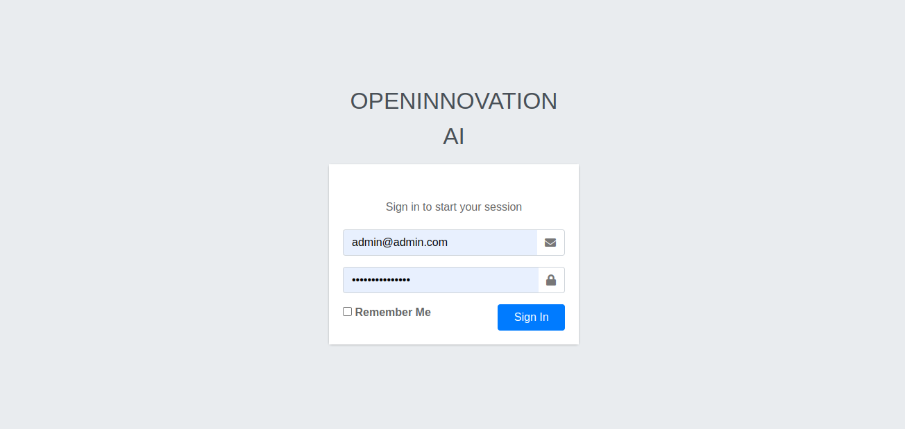
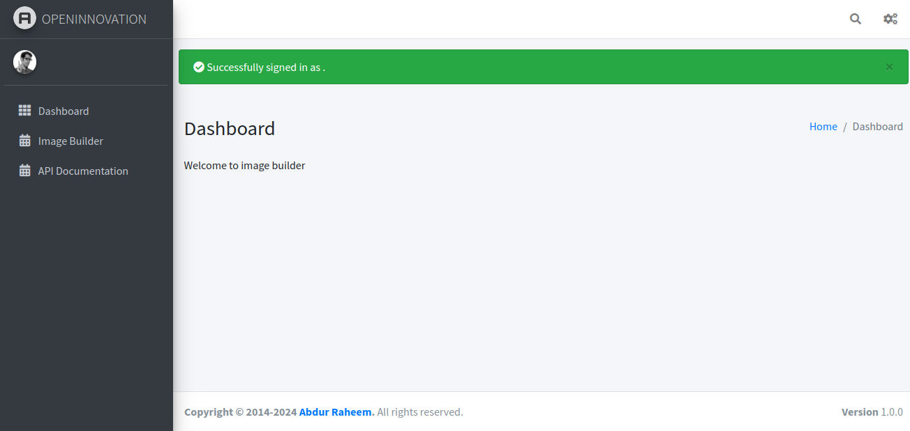
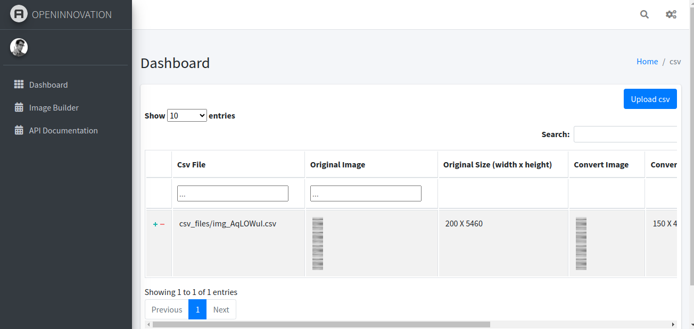
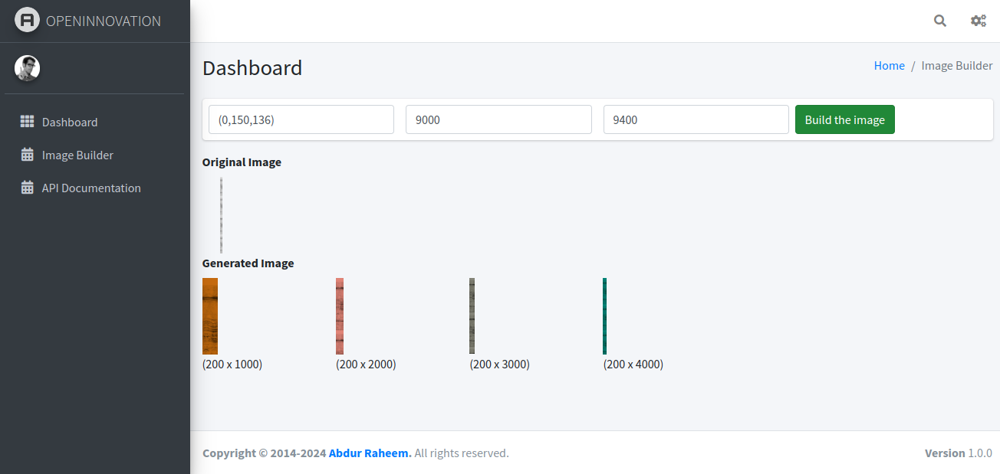

# Image Builder

## Getting Started

### Clone the Repository
First, clone the repository to your local machine using the following command:

```bash
$ git clone https://github.com/raheemiqram/pixel_to_image.git
```

Ensure that Python 3 and pip3 are installed on your system. If not, please install them using your system's package manager. Once installed, navigate to the project's root directory and create a virtual environment by running:

```bash
python3 -m venv venv
```

Then, activate the virtual environment:

On Windows:
```bash
.\venv\Scripts\activate
```

On macOS and Linux:
```bash
source venv/bin/activate
```

With the virtual environment activated, install the required dependencies using pip:

### Install Dependencies

```bash
$ pip install -r ./requirements/local.txt
```

Consider using a virtual environment for isolation.

### Running the Project

#### Using Makefile
If you have Make installed, you can simply run the project using the provided Makefile. Execute the following command:

```bash
$ make run
```

#### Without Makefile
If you don't have Make installed, you can still run the project by executing the following commands:

```bash
$ python manage.py makemigrations
$ python manage.py migrate
$ python manage.py test_data
$ python manage.py runserver
```

### Accessing the Application

Once the server is running, you can access the application via your web browser:

```bash
http://127.0.0.1:8000/
```

Login credentials:

- Username: admin@admin.com
- Password: admin@admin.com

### Access API via Swagger

You can access the API documentation and test the endpoints using Swagger UI. Here's the link:

```bash
http://127.0.0.1:8000/api/schema/swagger/
```

### Demo Link

You can also access a demo version of the application online:

```bash
https://raheemiqram.pythonanywhere.com/
https://raheemiqram.pythonanywhere.com/api/schema/swagger/
```

Login credentials are the same as above.

## Running Tests

To execute the test cases, run the following command:

```bash
$ make test
```


1. **Login Screen**: This screenshot shows the login page of the system. Users can enter their credentials to access the system.
   

2. **Dashboard**: After logging in, users are directed to the dashboard. This screenshot displays the main interface where users can access various features and functionalities.
   

3. **Image Builder Menu**: By clicking on the "Image Builder" menu, users are redirected to the page displaying the list of uploaded CSV files. Access this page via [this link](https://raheemiqram.pythonanywhere.com/dashboard/image_builder/list/).
   

4. **CSV Upload and Image Conversion**: In this screenshot, users can upload a CSV file by clicking the "Upload CSV" button [here](https://raheemiqram.pythonanywhere.com/dashboard/image_builder/upload/). Once uploaded, they can interact with the table and click the "Build" button to convert images according to the CSV data.
   